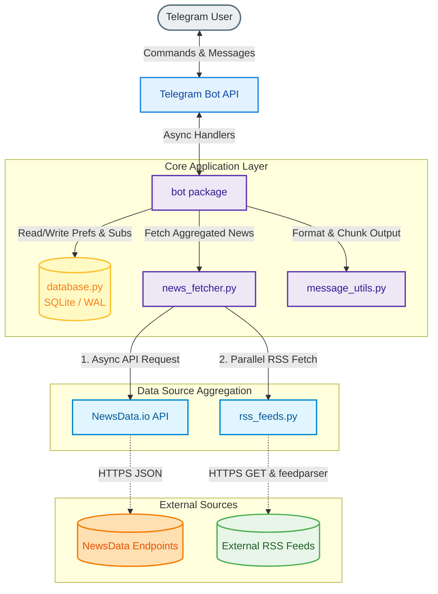

# newsdrop 📰

Your personalized daily news briefing, delivered straight to Telegram.


---

## Features

- **Daily News Delivery** - Automated news briefing at your preferred time.
- **Customizable Preferences** - Choose your country (10 regions) and category (7 topics).
- **Topic Search** - Search for specific news with built-in user rate limiting.
- **Followed Topics** - Follow, list, and remove custom topics (e.g., AI, crypto, climate).
- **Rich Article Previews** - Article thumbnails with inline "Read more" buttons.
- **Relative Timestamps** - See when articles were published ("2h ago", "30m ago").
- **Subscription Management** - Easy `/subscribe` and `/unsubscribe` commands.
- **SQLite Backend** - Thread-safe concurrent storage (WAL mode) for user data and preferences.
- **Breaking News Alerts** - Opt into scheduled breaking-news checks with duplicate suppression.
- **Trending Topics** - Discover what's trending globally across all regions.
- **Health Monitoring** - Detailed self-diagnostic checking for bot, API, and database status.
- **Multi-Source Aggregation** - Combines the NewsData.io API with curated RSS feeds (Times of India, NPR, BBC, The Guardian, and more) with automatic de-duplication and fallback.

---

## Tech Stack & Dependencies

* **Language:** Python 3.10+
* **Telegram Framework:** `python-telegram-bot` (version 22.x) with `job-queue` (APScheduler) support.
* **HTTP Client:** `httpx` (async requests for parallel news fetching).
* **Feed Parser:** `feedparser` (RSS feed parsing for fallback and augmentation).
* **Database:** SQLite (built-in, configured with Write-Ahead Logging for concurrent thread safety).
* **Configuration:** `python-dotenv` (environment variables).

---

## Architecture Overview

`newsdrop` is designed as a long-running stateful process. It connects to Telegram via **Long Polling**, stores user preferences in a local SQLite file, and maintains briefing and alert schedules in-memory using an asynchronous job queue.



---

## End-to-End Setup & Deployment

### Prerequisites
* A Telegram Bot Token (obtain from [@BotFather](https://t.me/botfather)).
* A NewsData.io API Key (sign up at [newsdata.io](https://newsdata.io) — free tier provides 200 requests/day).

---

### Option 1: Docker (Local / VM Deployment) - Recommended

Docker is the easiest way to run the bot locally or on a virtual private server, as it packages Python, system dependencies, and SQLite database permissions automatically.

1. Clone the repository and navigate inside:
   ```bash
   git clone https://github.com/sunil-gumatimath/newsdrop.git
   cd newsdrop
   ```

2. Copy the sample environment file:
   ```bash
   cp .env.example .env
   ```

3. Open `.env` and fill in your credentials:
   ```env
   TELEGRAM_BOT_TOKEN=your_telegram_bot_token
   NEWS_API_KEY=your_newsdata_io_api_key
   ```

4. Build and launch the container in the background:
   ```bash
   docker compose up -d --build
   ```

To check logs, run `docker compose logs -f`. To stop the bot, run `docker compose down`.

---

### Option 2: Local Python Installation (Development)

1. Clone the repository and navigate inside:
   ```bash
   git clone https://github.com/sunil-gumatimath/newsdrop.git
   cd newsdrop
   ```

2. Create a virtual environment and install dependencies:
   ```bash
   python -m venv .venv
   source .venv/bin/activate  # On Windows: .venv\Scripts\activate
   pip install -e .
   ```

3. Setup your `.env` file:
   ```bash
   cp .env.example .env
   # Add your TELEGRAM_BOT_TOKEN and NEWS_API_KEY
   ```

4. Launch the bot directly:
   ```bash
   python -m newsdrop
   ```

---

### Option 3: Hosting on Google Cloud Platform (GCP)

We support two ways to deploy the bot to Google Cloud Platform:

#### Method A: Deploying to an Existing GCE VM (e.g. `openclaw`)
If you already have a running GCE VM, you can deploy your local codebase directly to it with one command from your local machine.

* **On Windows (PowerShell):**
  ```powershell
  .\deploy_existing.ps1
  ```
* **On Linux/macOS/Git Bash:**
  ```bash
  chmod +x deploy_existing.sh
  ./deploy_existing.sh
  ```
*These scripts package your local files and `.env` config, copy them to your VM using `gcloud compute scp`, install Docker/Compose if missing, and start the container.*

#### Method B: Provisioning a New VM with Terraform
If you want to spin up a fresh, Free Tier eligible `e2-micro` VM from scratch:
1. Navigate to the `terraform/` directory: `cd terraform`
2. Create a `terraform.tfvars` containing your project variables and secrets.
3. Run `terraform init` and `terraform apply`.
*Google Cloud will automatically boot the VM, install Docker, clone your repository, write configurations securely from metadata, and run the bot.*

> [!NOTE]
> For complete instructions, variable details, database backup commands, and logging instructions, read the full [GCP Deployment Guide](file:///c:/Users/Tedz/OneDrive/Desktop/FUN/newsdrop/DEPLOY_GCP.md).

---

## Configuration Variables

Configure these settings inside your `.env` file (or pass them via environment variables):

| Variable | Default | Description |
|----------|---------|-------------|
| `TELEGRAM_BOT_TOKEN` | *Required* | Telegram bot token from BotFather |
| `NEWS_API_KEY` | *Required* | NewsData.io API key |
| `DAILY_NEWS_TIME` | `08:00` | Daily delivery time in 24-hour `HH:MM` format |
| `DEFAULT_COUNTRY` | `us` | Default country code for new users |
| `DATABASE_PATH` | `bot_data.db` | SQLite database location. Docker maps this to `/app/data/bot_data.db` |
| `ENABLE_RSS` | `1` | Enables RSS fallbacks and multi-source aggregation. Set to `0` to disable |
| `DAILY_REQUEST_LIMIT` | `200` | Local request limit to stay within free NewsData.io tier. Set to `0` to disable |
| `BREAKING_ALERT_INTERVAL_MINUTES` | `30` | Interval to check for breaking news alerts. Set to `0` to disable |
| `BREAKING_ALERT_RETENTION_DAYS` | `14` | Days to retain sent alert hashes to prevent duplicate alerts |
| `BREAKING_ALERT_KEYWORDS` | *Built-in list* | Comma-separated words to detect breaking stories (e.g. `breaking,war,earthquake`) |

---

## Bot Commands

| Command | Description |
|---------|-------------|
| `/start` | Welcome message and introduction |
| `/news` | Get latest news briefing using your saved preferences |
| `/search <topic>` | Search news by custom topic |
| `/follow <topic>` | Follow a custom topic like AI, climate, or crypto |
| `/unfollow <topic>` | Stop following a custom topic |
| `/follows` | View followed topics |
| `/unfollowall` | Remove all followed topics |
| `/subscribe` | Enable daily news delivery at your configured time |
| `/unsubscribe` | Disable daily news delivery |
| `/setcountry` | Choose your news region (10 choices) |
| `/setcategory` | Choose your news topic (7 choices) |
| `/prefs` | View your preferences and subscription status |
| `/breaking` | Toggle scheduled breaking-news alerts |
| `/trending` | View trending topics, optionally filtered by category |
| `/health` | Check bot status, API budget, and SQLite database health |
| `/clear` | Cleanup bot messages in the chat history |
| `/help` | Show all commands |

---

## Supported Regions & Categories

* **Supported Regions:** 🇺🇸 United States (`us`), 🇬🇧 United Kingdom (`gb`), 🇮🇳 India (`in`), 🇨🇦 Canada (`ca`), 🇦🇺 Australia (`au`), 🇩🇪 Germany (`de`), 🇫🇷 France (`fr`), 🇯🇵 Japan (`jp`), 🇧🇷 Brazil (`br`), 🇰🇷 South Korea (`kr`).
* **Supported Categories:** General, Technology, Business, Sports, Entertainment, Health, Science.

---

## Multi-Source Aggregation

To remain resilient against rate limits and service outages, `newsdrop` performs parallel asynchronous fetching:
1. **API request** to NewsData.io (for rich search and category indexes).
2. **RSS fetching** from national news feeds (e.g., NPR, Times of India, BBC, Sky News, France 24, etc.).
3. **De-duplication engine** that normalizes URLs and titles, filtering out duplicates while prioritizing articles with images.
4. **Graceful degradation** - if the API fails or is rate-limited, the bot continues serving news seamlessly using the RSS feeds.

---

## License

This project is licensed under the MIT License - see the [LICENSE](LICENSE) file for details.
