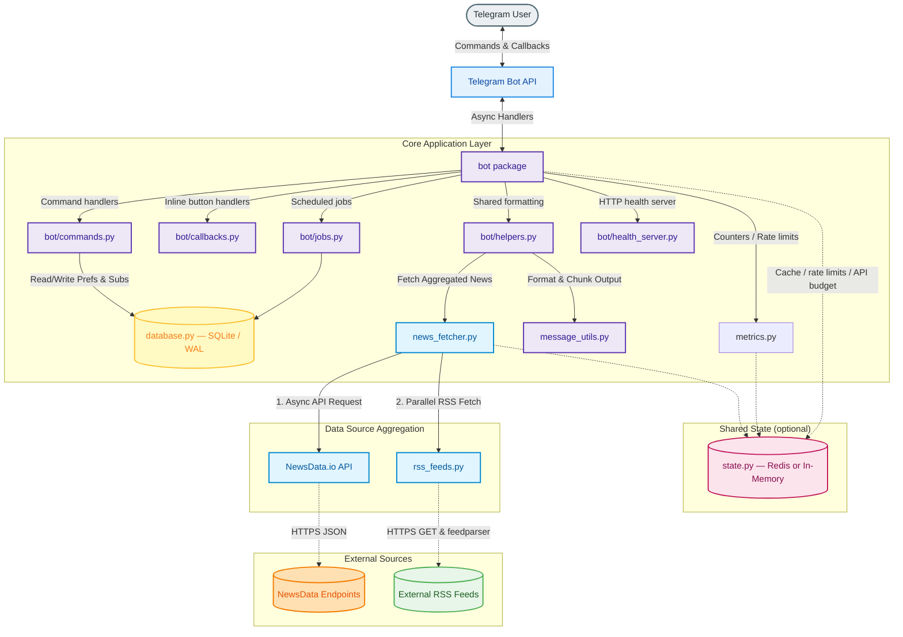

# newsdrop 📰

Your personalized daily news briefing, delivered straight to Telegram.


---

## Features

- **Daily News Delivery** — Automated news briefing at your configured time, grouped by `(country, category)` so the API is called once per unique combo.
- **Customizable Preferences** — Choose your country (10 regions) and category (7 topics) via inline buttons.
- **Topic Search** — Search for specific news with per-user rate limiting.
- **Followed Topics** — Follow custom topics (e.g., AI, crypto, climate) and see them highlighted in your daily digest.
- **Rich Article Previews** — Article thumbnails with inline "Read more" buttons.
- **Relative Timestamps** — See when articles were published ("2h ago", "30m ago").
- **Subscription Management** — Easy `/subscribe` and `/unsubscribe` commands.
- **SQLite Backend** — Thread-safe concurrent storage (WAL mode) for subscribers, preferences, topic follows, and alert dedupe.
- **Breaking News Alerts** — Opt into scheduled keyword-based breaking-news checks with duplicate suppression.
- **Trending Topics** — Discover what's trending for a category, optionally scoped to your country.
- **Health Monitoring** — Detailed self-diagnostic command plus built-in HTTP `/health`, `/ready`, and `/metrics` endpoints.
- **Multi-Source Aggregation** — Combines the NewsData.io API with curated RSS feeds (NPR, BBC, The Guardian, Times of India, France 24, and more) with automatic de-duplication and API-to-RSS fallback.
- **Graceful Shutdown** — SIGTERM/SIGINT handling drains in-flight updates and stops the job queue cleanly.

---

## Tech Stack & Dependencies

* **Language:** Python 3.11+
* **Telegram Framework:** `python-telegram-bot` 22.x with `job-queue` (APScheduler).
* **HTTP Client:** `httpx` (async requests for parallel news fetching).
* **Feed Parser:** `feedparser` (RSS feed parsing for fallback and augmentation).
* **Database:** SQLite (built-in, configured with Write-Ahead Logging for concurrent thread safety).
* **Shared State (optional):** `redis` (optional Redis backend for multi-worker deployments; falls back to in-memory when `REDIS_URL` is not set).
* **Configuration:** `python-dotenv` (environment variables).
* **Package/Environment Manager:** `uv` (lockfile in `uv.lock`).

---

## Architecture Overview

`newsdrop` is a long-running async process. It connects to Telegram via **Long Polling**, stores user preferences in a local SQLite file, and runs scheduled jobs in-memory using APScheduler.



---

## End-to-End Setup & Deployment

### Prerequisites

* A Telegram Bot Token (obtain from [@BotFather](https://t.me/botfather)).
* A NewsData.io API Key (sign up at [newsdata.io](https://newsdata.io) — free tier provides 200 requests/day).

---

### Option 1: Docker / Docker Compose (Recommended)

Docker is the easiest way to run the bot locally or on a VPS. It packages Python, system dependencies, SQLite permissions, and an optional Redis service automatically.

1. Clone the repository and navigate inside:
   ```bash
   git clone https://github.com/sunil-gumatimath/newsdrop.git
   cd newsdrop
   ```

2. Copy the sample environment file and fill in your secrets:
   ```bash
   cp .env.example .env
   # Edit .env and set TELEGRAM_BOT_TOKEN and NEWS_API_KEY
   ```

3. Build and launch the stack:
   ```bash
   docker compose up -d --build
   ```

> [!NOTE]
> The default Compose setup starts a Redis service alongside the bot and sets `REDIS_URL` automatically. Redis is used for shared cache, rate limits, and the API request budget. If you do not want Redis, remove the `redis` service and unset `REDIS_URL`; the bot will fall back to an in-memory backend.

Check logs with `docker compose logs -f`. Stop the bot with `docker compose down`.

---

### Option 2: Local Development with `uv`

1. Clone the repository:
   ```bash
   git clone https://github.com/sunil-gumatimath/newsdrop.git
   cd newsdrop
   ```

2. Install dependencies and sync the virtual environment:
   ```bash
   uv sync
   ```

3. Set up your `.env` file:
   ```bash
   cp .env.example .env
   # Edit .env and set TELEGRAM_BOT_TOKEN and NEWS_API_KEY
   ```

4. Launch the bot:
   ```bash
   uv run python -m newsdrop
   ```

---

### Option 3: Local Installation with `pip`

1. Clone the repository and create a virtual environment:
   ```bash
   git clone https://github.com/sunil-gumatimath/newsdrop.git
   cd newsdrop
   python -m venv .venv
   source .venv/bin/activate  # On Windows: .venv\Scripts\activate
   ```

2. Install the package:
   ```bash
   pip install -e .
   ```

3. Configure `.env` and run:
   ```bash
   cp .env.example .env
   # Edit .env
   python -m newsdrop
   ```

---

### Option 4: Hosting on Google Cloud Platform (GCP)

#### Method A: Deploying to an Existing GCE VM
If you already have a running GCE VM with Docker installed, clone the repository on the VM and start the Compose stack:

```bash
git clone https://github.com/sunil-gumatimath/newsdrop.git
cd newsdrop
cp .env.example .env   # then fill in your secrets
docker compose up -d --build
```

#### Method B: Provisioning a New VM with Terraform
To spin up a fresh, Free Tier eligible `e2-micro` VM from scratch:
1. Navigate to the `terraform/` directory: `cd terraform`
2. Create a `terraform.tfvars` containing your project variables and secrets.
3. Run `terraform init` and `terraform apply`.

Terraform provisions the VM, installs Docker, clones the repository, writes configurations, and runs the bot.

---

## Configuration Variables

Set these in your `.env` file or via environment variables:

| Variable | Default | Description |
|----------|---------|-------------|
| `TELEGRAM_BOT_TOKEN` | *Required* | Telegram bot token from BotFather |
| `NEWS_API_KEY` | *Required* | NewsData.io API key |
| `DAILY_NEWS_TIME` | `08:00` | Daily delivery time in 24-hour `HH:MM` format |
| `DEFAULT_COUNTRY` | `us` | Default country code for new users |
| `DATABASE_PATH` | `<project-root>/data/bot_data.db` | SQLite database location. In Docker this is `/app/data/bot_data.db` |
| `ENABLE_RSS` | `1` | Enables RSS fallbacks and multi-source aggregation. Set to `0` to disable |
| `DAILY_REQUEST_LIMIT` | `200` | Local request limit to stay within the free NewsData.io tier. Set to `0` to disable |
| `NEWS_COOLDOWN_SECONDS` | `30` | Per-user cooldown for `/news` and `/trending` (the latter reuses this value). Set to `0` to disable |
| `SEARCH_COOLDOWN_SECONDS` | `10` | Per-user cooldown for `/search` and inline search buttons. Set to `0` to disable |
| `REDIS_URL` | *(empty)* | Redis connection URL for multi-worker shared state. Leave empty for single-worker in-memory mode |
| `REDIS_PASSWORD` | `change-me-to-a-strong-password` | Password for the Docker Compose Redis container |
| `LOG_LEVEL` | `INFO` | Logging level: `DEBUG`, `INFO`, `WARNING`, or `ERROR` |
| `LOG_FORMAT` | `text` | Log format: `text` for human-readable or `json` for structured production logs |
| `HEALTH_PORT` | `8080` | Port for the built-in HTTP health server |
| `NEWSDROP_USER_AGENT` | *(built-in)* | Custom `User-Agent` header for RSS feed requests |
| `BREAKING_ALERT_INTERVAL_MINUTES` | `30` | Interval to check for breaking news alerts. Set to `0` to disable |
| `BREAKING_ALERT_RETENTION_DAYS` | `14` | Days to retain sent-alert records to prevent duplicate alerts |
| `BREAKING_ALERT_KEYWORDS` | *Built-in list* | Comma-separated words to detect breaking stories (e.g. `breaking,war,earthquake`) |

---

## Bot Commands

| Command | Description |
|---------|-------------|
| `/start` | Welcome message and introduction |
| `/news` | Get latest news briefing using your saved preferences |
| `/search <topic>` | Search news by custom topic |
| `/follow <topic>` | Follow a custom topic like AI, climate, or crypto |
| `/unfollow <topic>` | Stop following a custom topic |
| `/follows` | View followed topics |
| `/topics` | Alias for `/follows` |
| `/unfollowall` | Remove all followed topics (with confirmation) |
| `/subscribe` | Enable daily news delivery at your configured time |
| `/unsubscribe` | Disable daily news delivery |
| `/setcountry` | Choose your news region via inline buttons (10 choices) |
| `/setcategory` | Choose your news topic via inline buttons (7 choices) |
| `/prefs` | View your preferences, subscription status, and followed topics |
| `/breaking` | Toggle scheduled breaking-news alerts on/off |
| `/trending [category] [country]` | View trending topics for a category; defaults to your saved country |
| `/health` | Check bot status, API budget, and SQLite database health |
| `/clear` | Clean up recent bot messages in the chat (with confirmation) |
| `/help` | Show all commands |
| `/commands` | Alias for `/help` |

---

## Supported Regions & Categories

* **Supported Regions:** 🇺🇸 United States (`us`), 🇬🇧 United Kingdom (`gb`), 🇮🇳 India (`in`), 🇨🇦 Canada (`ca`), 🇦🇺 Australia (`au`), 🇩🇪 Germany (`de`), 🇫🇷 France (`fr`), 🇯🇵 Japan (`jp`), 🇧🇷 Brazil (`br`), 🇰🇷 South Korea (`kr`).
* **Supported Categories:** General, Technology, Business, Sports, Entertainment, Health, Science.

---

## Multi-Source Aggregation

To remain resilient against rate limits and outages, `newsdrop` fetches in parallel:

1. **NewsData.io API** request for the primary headline set or search query.
2. **RSS feeds** from national sources (e.g., NPR, BBC, The Guardian, Times of India, France 24, NDTV, Reuters, Associated Press).
3. **De-duplication** by normalized URL and title, sorted by publish time.
4. **Graceful degradation** — if the API is down or rate-limited, the bot still serves RSS results.

---

## HTTP Health Endpoints

When the bot starts it exposes a lightweight stdlib HTTP server (port `8080` by default) for orchestrators and load balancers:

* `GET /health` — returns `{"status": "ok"}` when the process is running.
* `GET /ready` — returns `{"status": "ready"}` once the Telegram application has been built.
* `GET /metrics` — returns all named counters plus 1-hour and 24-hour sliding-window rates.

---

## Development & Testing

The project uses `uv` for dependency management and includes `ruff`, `mypy`, `pytest`, `pytest-asyncio`, and `pytest-cov`.

```bash
# Run the test suite (with coverage)
uv run pytest

# Run only unit tests
uv run pytest tests/unit/

# Run only integration tests
uv run pytest tests/integration/

# Linting
uv run ruff check .

# Auto-fix lint issues
uv run ruff check --fix .

# Formatting
uv run ruff format .

# Type checking
uv run mypy src/newsdrop
```

---

## License

This project is licensed under the MIT License — see the [LICENSE](LICENSE) file for details.
