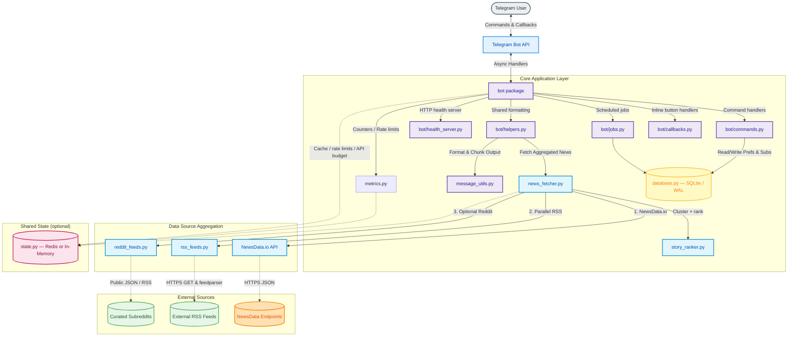

# newsdrop 📰

Your personalized news briefing, delivered straight to Telegram.


---

## Features

- **Guided onboarding** — `/start` walks region → category → subscribe or get news now.
- **Daily digests** — Scheduled briefings at each user’s local hour; API batched by `(country, category)`.
- **On-demand `/news`** — Card layout with blurbs, relative time, source line, multi-outlet tags, and open-article buttons.
- **Smart ranking** — Story clustering, source trust weights, followed-topic boost, optional Reddit popularity signal.
- **Topic search** — `/search` with whole-word matching, relevance ranking, and one-tap **Follow**.
- **Followed topics** — Float matches to the top of digests with `📌` why-tags.
- **Breaking alerts** — Compact alerts with matched keyword reason, daily cap, open button; quiet hours supported.
- **Multi-source aggregation** — NewsData.io + country/category RSS (+ optional Reddit); cache and free-tier budget protection.
- **Preferences** — Region, category, digest hour, timezone, quiet hours, breaking keywords.
- **`/clear`** — Clean recent bot-accessible messages (with confirmation).
- **SQLite + optional Redis** — WAL SQLite for prefs/subs/dedupe; Redis for shared cache/rate limits when set.
- **Health endpoints** — HTTP `/health`, `/ready`, `/metrics`; admin `/health` command.
- **Graceful shutdown** — SIGTERM/SIGINT drains work and stops the job queue cleanly.

See [FEATURE.md](./FEATURE.md) for the full command list and [AGENTS.md](./AGENTS.md) for architecture notes for coding agents.

---

## Tech Stack & Dependencies

* **Language:** Python 3.11+
* **Telegram Framework:** `python-telegram-bot` 22.x with `job-queue` (APScheduler).
* **HTTP Client:** `httpx` (async; shared client for NewsData.io).
* **Feed Parser:** `feedparser` (RSS).
* **Database:** SQLite (WAL mode).
* **Shared State (optional):** Redis when `REDIS_URL` is set; otherwise in-memory.
* **Configuration:** `python-dotenv`.
* **Package manager:** `uv` (lockfile in `uv.lock`).

---

## Architecture Overview

`newsdrop` is a long-running async process. It connects to Telegram via **long polling**, stores preferences in SQLite, and runs scheduled jobs with APScheduler.



---

## End-to-End Setup & Deployment

### Prerequisites

* A Telegram Bot Token (from [@BotFather](https://t.me/botfather)).
* A NewsData.io API Key ([newsdata.io](https://newsdata.io) — free tier typically ~200 requests/day).

---

### Option 1: Docker / Docker Compose (Recommended)

1. Clone and enter the repo:
   ```bash
   git clone https://github.com/sunil-gumatimath/newsdrop.git
   cd newsdrop
   ```

2. Configure secrets:
   ```bash
   cp .env.example .env
   # Set TELEGRAM_BOT_TOKEN and NEWS_API_KEY
   ```

3. Build and launch:
   ```bash
   docker compose up -d --build
   ```

> [!NOTE]
> Default Compose starts Redis and sets `REDIS_URL`. Remove Redis and unset `REDIS_URL` for in-memory single-worker mode.

Logs: `docker compose logs -f`. Stop: `docker compose down`.

---

### Option 2: Local Development with `uv`

```bash
git clone https://github.com/sunil-gumatimath/newsdrop.git
cd newsdrop
uv sync
cp .env.example .env   # fill secrets
uv run python -m newsdrop
```

---

### Option 3: Local Installation with `pip`

```bash
git clone https://github.com/sunil-gumatimath/newsdrop.git
cd newsdrop
python -m venv .venv
source .venv/bin/activate  # Windows: .venv\Scripts\activate
pip install -e .
cp .env.example .env
python -m newsdrop
```

---

### Option 4: Hosting on Google Cloud Platform (GCP)

#### Method A: Existing GCE VM with Docker

```bash
git clone https://github.com/sunil-gumatimath/newsdrop.git
cd newsdrop
cp .env.example .env   # fill secrets
docker compose up -d --build
```

#### Method B: New VM with Terraform

1. `cd terraform`
2. Create `terraform.tfvars` with project variables and secrets.
3. `terraform init` then `terraform apply`.

---

## Configuration Variables

| Variable | Default | Description |
|----------|---------|-------------|
| `TELEGRAM_BOT_TOKEN` | *Required* | Telegram bot token from BotFather |
| `NEWS_API_KEY` | *Required* | NewsData.io API key |
| `DAILY_NEWS_TIME` | `08:00` | Fallback daily hour seed (`HH:MM`); per-user hour via `/settime` |
| `DEFAULT_COUNTRY` | `us` | Default region for new users |
| `DEFAULT_TIMEZONE` | `UTC` | Default IANA timezone |
| `DATABASE_PATH` | `<project-root>/data/bot_data.db` | SQLite path (Docker: `/app/data/bot_data.db`) |
| `ENABLE_RSS` | `1` | RSS augmentation/fallback. Set `0` to disable |
| `ENABLE_REDDIT` | `0` | Reddit popularity boost. Set `1` to enable (no Reddit API key) |
| `DAILY_REQUEST_LIMIT` | `200` | Local NewsData.io budget. Set `0` to disable gate |
| `NEWS_COOLDOWN_SECONDS` | `0` | Per-user cooldown for `/news` / `/trending`. `0` = off |
| `SEARCH_COOLDOWN_SECONDS` | `0` | Per-user cooldown for `/search`. `0` = off |
| `REDIS_URL` | *(empty)* | Shared state for multi-worker; empty = in-memory |
| `REDIS_PASSWORD` | `change-me-to-a-strong-password` | Docker Compose Redis password |
| `LOG_LEVEL` | `INFO` | `DEBUG`, `INFO`, `WARNING`, or `ERROR` |
| `LOG_FORMAT` | `text` | `text` or `json` |
| `HEALTH_PORT` | `8080` | HTTP health server port |
| `NEWSDROP_USER_AGENT` | *(built-in)* | User-Agent for RSS / Reddit fetches |
| `ADMIN_CHAT_IDS` | *(empty)* | Comma-separated IDs allowed to use Telegram `/health` |
| `BREAKING_ALERT_INTERVAL_MINUTES` | `30` | Breaking poll interval; `0` disables job |
| `BREAKING_ALERT_RETENTION_DAYS` | `14` | Dedupe retention for sent alerts |
| `BREAKING_ALERT_MAX_PER_DAY` | `5` | Max breaking alerts per user per day |
| `BREAKING_ALERT_KEYWORDS` | *Built-in list* | Default keywords when user has none |
| `BREAKING_USE_FOLLOWED_TOPICS` | `1` | Global default for using follows as alert keywords |
| `MAX_BREAKING_KEYWORDS_PER_USER` | `10` | Cap on personal `/breakkeywords` list |

---

## Bot Commands

| Command | Description |
|---------|-------------|
| `/start` | Guided setup (region → category → subscribe / news) |
| `/news` | Latest ranked briefing for your prefs |
| `/search <topic>` | Search with whole-word relevance + follow button |
| `/follow <topic>` | Follow a topic for ranking & highlights |
| `/unfollow <topic>` | Unfollow one topic |
| `/follows` / `/topics` | List followed topics |
| `/unfollowall` | Clear all follows (confirm) |
| `/subscribe` | Enable daily digest |
| `/unsubscribe` | Disable daily digest |
| `/setcountry` | Pick region (World + 10 countries) |
| `/setcategory` | Pick category (7 topics) |
| `/settime` | Local hour for daily digest |
| `/settimezone` | IANA timezone |
| `/quiet` | Quiet hours for alerts (`22 7` or `off`) |
| `/prefs` | Show all preferences |
| `/breaking` | Toggle breaking alerts + follow-as-keywords option |
| `/breakkeywords` | Manage personal alert keywords |
| `/trending [category]` | Trending topics (+ follow/search buttons) |
| `/clear` | Clear recent bot-accessible messages (confirm) |
| `/health` | Admin diagnostics (`ADMIN_CHAT_IDS`) |
| `/help` / `/commands` | Full command list |

---

## Supported Regions & Categories

* **Regions:** 🌐 World, 🇺🇸 US, 🇬🇧 UK, 🇮🇳 India, 🇨🇦 Canada, 🇦🇺 Australia, 🇩🇪 Germany, 🇫🇷 France, 🇯🇵 Japan, 🇧🇷 Brazil, 🇰🇷 South Korea.
* **Categories:** General, Technology, Business, Sports, Entertainment, Health, Science.

---

## Multi-Source Aggregation

Fetches run in parallel where possible:

1. **NewsData.io** — primary structured headlines / search.
2. **RSS** — country feeds + category-specific feeds (tech, sports, science, …); feed health cooldown on repeated failures.
3. **Reddit** (optional, `ENABLE_REDDIT=1`) — boost stories also hot in curated subreddits.
4. **Cluster + rank** — near-duplicate merge; trust, multi-source corroboration, freshness, Reddit signal.
5. **Graceful degradation** — if the API budget or API itself fails, RSS can still fill digests.

Search applies **whole-word** filters and relevance ranking so short queries (e.g. `AI`) do not match substrings inside unrelated words.

---

## HTTP Health Endpoints

Default port `8080`:

* `GET /health` — process up: `{"status": "ok"}`.
* `GET /ready` — Telegram app ready.
* `GET /metrics` — named counters and sliding-window rates.

---

## Development & Testing

```bash
# Full suite with coverage
uv run pytest

# Unit only (fast, mocked)
uv run pytest tests/unit/

# Integration (needs keys + network)
uv run pytest tests/integration/

uv run ruff check .
uv run ruff check --fix .
uv run ruff format .
uv run mypy src/newsdrop
```

---

## License

This project is licensed under the MIT License — see the [LICENSE](LICENSE) file for details.
